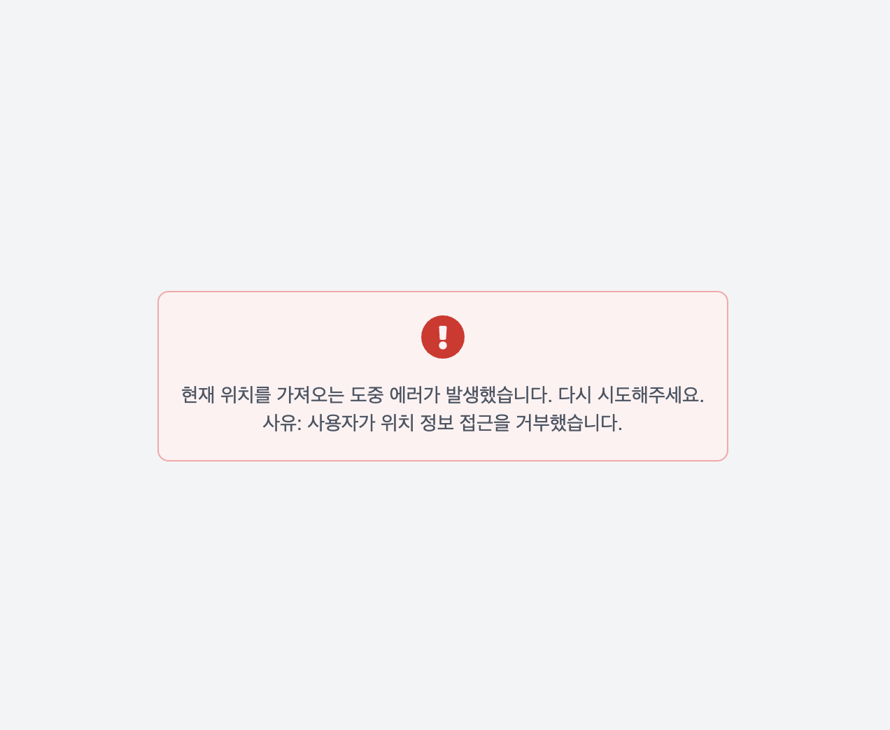

# Simple Weather Visualizer

간단한 날씨 시각화 웹페이지입니다.

- 디자인 및 날씨 시각화와 관련한 구현은 없거나 최소한만 있습니다.

기타 문서

- [일정 산정](STORYPOINTS.md)
- [API 파악](API.md)

## 1. Features

1. 현재 위치 가져오기
2. 대한민국 내의 특정 지역 검색 및 해당 지역의 위치 가져오기
3. 가져온 위치에 대한 오늘 날씨를 시간 단위로 표시하기
4. 특정 지역에 대한 즐겨 찾기의 목록 표시 및 토글하기
5. 로딩, 오류 표시하기

## 2. Demo

| 번호 | 항목 | 이미지                                          |
| ---- | ---- | ----------------------------------------------- |
| 1    | 기본 |          |
| 2    | 검색 |  |
| 3    | 로딩 |        |
| 4    | 오류 |          |

## 3. Tech Stack

- TypeScript
- Next.js 14, React 18.3
- TailwindCSS 3, clsx
- ESLint, Prettier
- react-window
  - 지역 개수가 5천개가 넘어 렉이 발생하여 windowing 활용해 성능 개선
- react-icons
  - 일부 아이콘 필요한 곳에서 사용
- jest (+ts-node)
  - 일부 유틸성 함수들에 대한 단위 테스트

## 4. Architecture

- Next.js 14 App Router를 사용합니다.
- 각 폴더는 index.ts로 내보냅니다. (Barrel File)

```text
src
├── app (Next.js App Router 루트 폴더)
│   ├── _modules (페이지 별 구현 상세 폴더 - 이 경우 app/page.tsx의 내부 구현 폴더)
│   │   ├── CurrentLocation.tsx
│   │   ├── FavoriteLocations.tsx
│   │   ├── index.ts
│   │   ├── LocationSearchBox.tsx
│   │   ├── useFavorites.ts
│   │   └── WeatherCard.tsx
│   ├── api (기상청 API 프록시, AccessKey 노출 최소화, 프론트엔드를 위한 간단한 매핑 수행)
│   │   └── weather
│   │       └── route.ts
│   ├── globals.css
│   ├── layout.tsx
│   └── page.tsx
├── assets (소스 코드 상에서 직접 사용하는 리소스 - 이미지 등)
│   ├── locations_with_geocoordinates.json (지역 별 좌표 JSON)
│   └── locations_with_geocoordinates.type.ts
├── components (특정 사용 사례와 무관한 공통 UI 컴포넌트)
│   ├── FavoriteToggleButton.tsx
│   ├── FullPageErrorMessage.tsx
│   ├── FullPageSpinner.tsx
│   ├── index.ts
│   ├── SearchBar.tsx
│   └── SearchListItem.tsx
├── features (특정 기능 구현에 필요한 코드들 - 기본 구현 코드와 이를 리액트로 연동하는 훅 포함)
│   ├── geolocation (위치 관련 기능)
│   │   ├── external (외부 API, SDK 사용 시 external 폴더 사용)
│   │   │   ├── kakaoMap
│   │   │   │   ├── getLocationByGeoCoordinates.ts
│   │   │   │   ├── index.ts
│   │   │   │   ├── kakao.d.ts
│   │   │   │   └── kakaoGeocoderSDK.ts
│   │   │   └── index.ts
│   │   ├── hooks
│   │   │   ├── index.ts
│   │   │   ├── useCurrentGeoCoordinates.ts
│   │   │   └── useLocationNameByGeoCoordinates.ts
│   │   └── index.ts
│   └── weather (날씨 관련 기능)
│       ├── api (프론트엔드에서 사용하는 날씨 기능 관련 API 요청 코드)
│       │   ├── getWeatherForGeoCoordinates.ts
│       │   └── index.ts
│       ├── external
│       │   ├── government
│       │   │   ├── apiMapper
│       │   │   │   ├── groupByForecastTime.test.ts
│       │   │   │   ├── groupByForecastTime.ts
│       │   │   │   ├── index.ts
│       │   │   │   ├── mapArrayToObject.test.ts
│       │   │   │   ├── mapArrayToObject.ts
│       │   │   │   ├── mapForecastItem.test.ts
│       │   │   │   ├── mapForecastItem.ts
│       │   │   │   └── mapWeatherApiResponse.ts
│       │   │   ├── coordinatesConverter
│       │   │   │   ├── convertGeoCoordinatesToGridCoordinates.test.ts
│       │   │   │   ├── convertGeoCoordinatesToGridCoordinates.ts
│       │   │   │   └── index.ts
│       │   │   ├── index.ts
│       │   │   └── weatherApiType.ts
│       │   └── index.ts
│       └── index.ts
├── types (공통 타입 정의 - 내부 타입 및 프론트엔드에서 사용하는 API에 대한 타입)
│   ├── api
│   │   ├── index.ts
│   │   └── WeatherApiResponse.ts
│   ├── GeoCoordinates.ts
│   └── index.ts
└── utils (공통 유틸 정의 - 기능 구현 코드 및 공통 훅)
    ├── functions
    │   ├── DateUtils.ts
    │   └── index.ts
    ├── hooks
    │   ├── index.ts
    │   ├── useFetch.ts
    │   └── useLocalStorageState.ts
    └── index.ts
```
